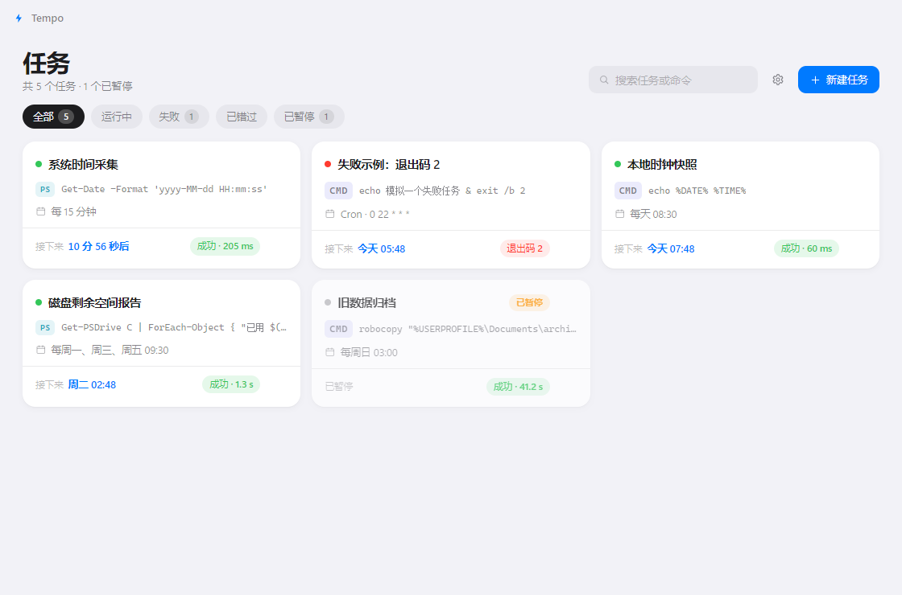

# Tempo · 好看的定时任务卡片

> 一个好看、轻快的 Windows 桌面定时任务工具。每张卡片是一条命令和它的执行计划，到点自动执行，结果如实可见。

**English**: Tempo is a lightweight, beautifully crafted Windows desktop app for scheduling commands as cards — one-shot, interval, daily, weekly, or cron. Built with Electron + React.



## 特性

- **卡片式任务管理**：每张卡片对应一条命令（CMD / PowerShell / Python），状态、计划、上次结果一目了然
- **灵活的执行计划**：执行一次、固定间隔、每天、每周（选星期）、5 字段 Cron 表达式
- **可信的执行信息**：运行状态、下次执行倒计时、历史记录、退出码、stdout/stderr、耗时
- **可靠的调度**：到点即触发；应用未运行/系统睡眠期间错过的调度，启动或唤醒时可自动补跑（按任务配置）
- **克制的常驻**：普通窗口应用，关窗即退出；无后台服务、无开机自启、不写注册表
- **iOS 风格视觉**：深浅色主题跟随系统，连续圆角、克制阴影、干脆的动效

## 快速开始

### 方式一：下载安装包（推荐）

从 [Releases](https://github.com/GardenOfKruse/tempo-tasks/releases/latest) 下载：

- **`Tempo-Setup-x.y.z.exe`** — 安装版，双击即装（自动创建开始菜单与桌面快捷方式，免管理员权限），装完自动启动
- `Tempo-Portable-x.y.z.exe` — 免安装单文件，适合 U 盘携带
- `Tempo-x.y.z-win.zip` — 解压即用

### 方式二：从源码运行

```bash
npm install
npm run dev        # 构建并启动
```

要求：Node.js ≥ 20，Windows 10/11。

## 使用

1. 点「新建任务」，填写名称与命令，选择执行方式（CMD / PowerShell / Python）与执行计划
2. 保存后卡片进入任务列表，到点自动执行；也可以悬停卡片点 ▶ 立即运行
3. 点击卡片打开详情：查看历史、输出与错误、退出码、耗时；随时暂停或编辑

### 执行计划的语义

| 类型 | 语义 |
|---|---|
| 一次 | 到指定时刻执行；应用未运行而错过则标记「已错过」，不自动补跑 |
| 固定间隔 | 上一次调度后每 N 分钟触发 |
| 每天 / 每周 | 本地时间到点触发 |
| Cron | 5 字段（分 时 日 月 周），本地时区；「日」与「星期」同时受限时按标准语义取并集 |

**错过补跑**（按任务开关，默认开）：应用关闭或睡眠期间错过的周期调度，会在下次启动或系统唤醒时补跑一次。Tempo 只在应用运行期间调度，不伪装后台/唤醒能力。

## 数据与隐私

- 全部数据存在本地 `%APPDATA%/tempo-tasks/`（单 JSON 文件 + 备份），设置内可一键打开
- 每任务保留最近 50 条执行记录，输出每流截断至尾部 32KB
- 无遥测、无网络上报

## 开发

```bash
npm test         # 域逻辑单测（cron 解析、计划计算、校验）
npm run e2e      # 端到端测试（playwright 驱动真实 Electron，21 项）
npm run build    # 类型检查 + 构建
npm run dist:dir # 打包（win-unpacked）
npm run dist     # 打包（zip + portable）
```

结构：`electron/` 主进程（调度器/执行器/存储/计划模型），`src/` 渲染端（React），`tests/` 测试，`scripts/` 构建与测量脚本。域逻辑为纯函数，渲染端复用同一份做表单校验。

## 许可证

[MIT](LICENSE) · 作者 [GardenOfKruse](https://github.com/GardenOfKruse)
